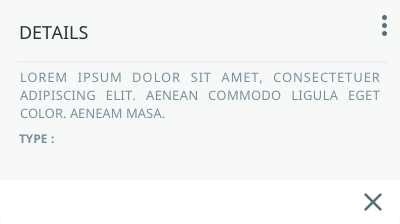

# Artboards

This is an autogenerated file showing all the artboards. Do not edit it directly.

## 1-Moc - Sign in

## 1.1-Moc - Sign in input selected

## 1.2-Moc - Sign in error message password

## 1.2-Moc - Sign in error message username

## 1.3-Moc - Sign in wrong username

## 10 min

## 2-Moc - change password Copy

## 2-Moc - change password unfilled inputs

## 2-Moc - change password

## 2.1-Moc - change password error password

## 2.2-Moc - change password do not match

## 20 min

## 3-Moc - Find account wrong username

## 3-Moc - Find account

## 30 min

## 4-MOC - Operaciones - AOG 

## 4-MOC - Operaciones - CONTINGENCY Copy 2

## 4-MOC - Operaciones - CONTINGENCY Copy 3

## 4-MOC - Operaciones - CONTINGENCY Copy

## 4-MOC - Operaciones - CONTINGENCY tooltip

## 4-MOC - Operaciones - CONTINGENCY

## 5-MOC - Operaciones - AOG 

## 5-MOC - Operaciones - CONTINGENCE - nav draw Copy 2

## 5-MOC - Operaciones - CONTINGENCE - nav draw Copy

## 6-MOC - Operaciones - AOG 

## 7-MOC - Operaciones - AOG 

## 7-MOC - Operaciones - CONTINGENCE - task details comments Copy 2

## 7-MOC - Operaciones - CONTINGENCE - task details comments Copy

## 8-MOC - Operaciones - AOG 

## 8-MOC - Operaciones - CONTINGENCE - task details timeline Copy 2

## 8-MOC - Operaciones - CONTINGENCE - task details timeline Copy

## 9-MOC - Operaciones - Crear contingencia Copy 2

## 9-MOC - Operaciones - Crear contingencia Copy 3

## 9-MOC - Operaciones - Crear contingencia Copy

## 9.1-MOC - Operaciones - Crear contingencia - success

## 9.2-MOC - Operaciones - Crear contingencia - connection timed out

## 9.3-MOC - Operaciones - Crear contingencia complete fields required

## 9.4-MOC - Operaciones - Crear contingencia oops something went wrong

## 9.5-MOC - Operaciones - Crear contingencia this flight already exist

## 9.6-MOC - Operaciones - Crear contingencia cancel

## Border

## Forms

## Icon

## Logo Maintenix

## MOC - Dashboard View - 1st level

## MOC - Operaciones - AOG 

## MOC - Operaciones - Crear contingencia already exists

## MOC - Operaciones - Crear contingencia complete all Copy

## MOC - Operaciones - Crear contingencia complete all

## MOC - Operaciones - Crear contingencia connection timed out

## MOC - Operaciones - Crear contingencia success

## MOC - Operaciones - Crear contingencia

## MOC - Operaciones -Edit Contingency

## MOC - Operaciones -Save

## MOC - toasts

## Material

## Moc - Login

## alerta1

## barra amarilla

## barra azul

## barra naranja

## barra roja

## blue text button

## card amarilla aog

## card amarilla contingence

## card etr aog

## card etr contingence

## card expand etr aog

## card expand naranja aog

## card expand roja aog

## card expand

## card naranja aog

## card naranja contingence

## card roja aog

## card roja contingence

## cart

## etr

## flipcard amarilla contingency

## flipcard

## icono avion amarillo

## icono avion etr

## icono avion naranjo

## icono avion rojo

## icono colapsar hacia arriba

## icono lista activo

## icono tarjetas activo

## icono vista lista inactivo

## list_3_unchecked

## llave

## location

## operador

## paper-dialog

## paper-radio-group

## paper-toast alert

## paper-toast status

## person

## tarjeta amarilla aog expandida

## tarjeta amarilla contingencia expandida

